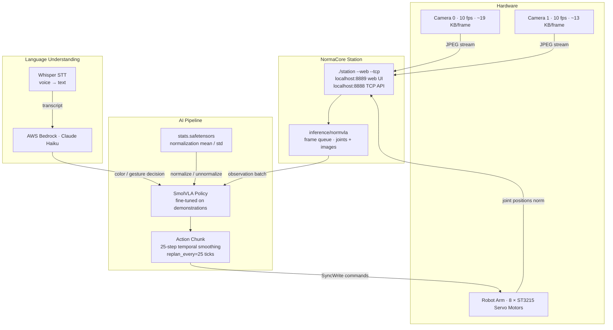
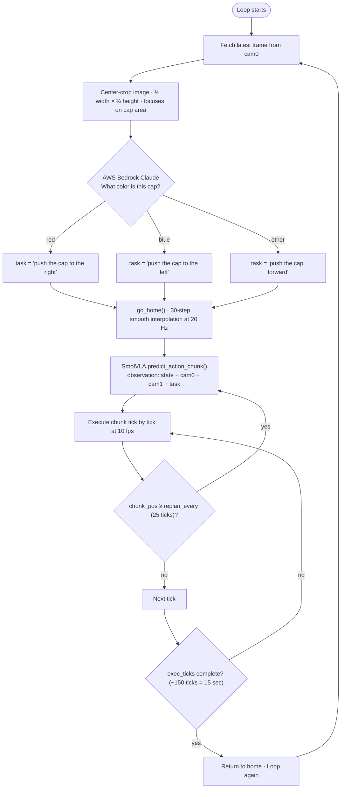
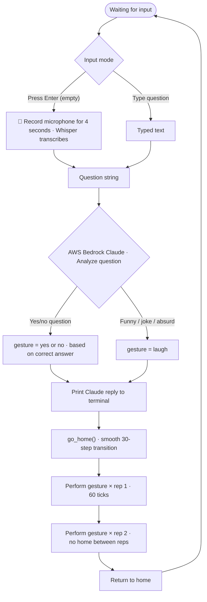

# NORMA — Natural Object Recognition & Motion Automation

> **Berlin AI × Robotics Hackathon · "AI-Powered Robot Control" track**
> *"Teaching robots to see, think, and move — with just a few demonstrations."*

Built on: **NormaCore · SmolVLA · Claude (Anthropic) · AWS Bedrock · NVIDIA RTX 4060**

Three live demos:
- 🦾 An LLM that picks a carrot, drops it in a box, and comes home — autonomously
- 🧠 The same LLM *supervising* a neural policy and rescuing it when it fails
- 🔵🔴 A robot that sorts colored caps and answers questions with gestures

> 📂 **Claude Supervisor code lives in [`claude-supervisor/`](claude-supervisor/)** — see [its README](claude-supervisor/README.md) for the file-by-file guide.

---

## The Challenge

**Learned robot policies are fast — but brittle. LLMs reason well — but are slow. Nobody has wired them together at runtime.**

| Problem | Reality today |
|---|---|
| Neural policies (VLA) | Hover, fumble, freeze — no self-recovery |
| LLM-on-robot (SayCan, RT-H) | LLM used only at *plan time*, then trusts a black box |
| Industrial robot arms | $50K–$500K, months to deploy, need robotics engineers |
| Teaching a robot a new task | Requires reprogramming from scratch |

**The core gap:**
> Prior work uses the LLM *before* execution. We keep it *in the loop during execution* — watching, judging, and taking over when the policy fails.

---

## The Solution

**Three systems built and working today:**

### 1 — Claude Supervisor (pick-and-place + runtime policy rescue)
We wired Claude directly into NormaCore's 8-DOF ElRobot arm. It sees through the robot's cameras, reasons about the scene, and drives the arm through a full pick-and-place (carrot → box → home). It also acts as a **live supervisor** over SmolVLA: when the policy hovers, misses, or freezes, **Claude pauses it and takes over with corrected joint commands.**

### 2 — Color Sorting Robot
Camera sees a colored cap → AWS Claude identifies the color → SmolVLA moves the arm to push it to the correct bin. No hard-coded positions. No IK solver. Pure learned behavior.

### 3 — Gesture Q&A Oracle
You speak or type a question → Claude reasons about the answer → SmolVLA performs the correct gesture (yes / no / laugh) — twice, for emphasis.

**Key insight:** The same framework — record demonstrations, fine-tune, deploy — works for any physical task.

---

## Architecture

### The Big Picture

```
                          ┌──────────────────────────────────┐
                          │   GOAL (in plain English):       │
                          │   "pick the carrot, put it in    │
                          │    the box, come home"           │
                          └────────────────┬─────────────────┘
                                           │
                    ╔══════════════════════▼══════════════════════╗
                    ║        CLAUDE   ⟷   ElRobot  (8-DOF arm)     ║
                    ║      an LLM as the robot's reasoning layer    ║
                    ╚══════════════════════╤══════════════════════╝
      ┌──────────────┬─────────────────────┼─────────────────────┬──────────────┐
      │              │                     │                     │              │
 ┌────▼────┐    ┌────▼─────┐         ┌─────▼─────┐         ┌─────▼─────┐   ┌────▼─────┐
 │  EYES   │    │  BRAIN   │         │   HANDS   │         │  SKILLS   │   │ TWO-BRAIN│
 │ 2 USB   │    │  Claude  │         │  ST3215   │         │ taught on │   │ supervise│
 │ cameras │    │  (LLM)   │         │  servos   │         │ hardware  │   │ the VLA  │
 └────┬────┘    └────┬─────┘         └─────┬─────┘         └─────┬─────┘   └────┬─────┘
      │              │                     │                     │              │
 observe() =   reason over the      bounded, absolute     • learned IK by   pause → correct
 image + joint  scene; decide;      joint targets via      demonstration     → resume:
 in ONE call    PREEMPT the policy  atomic sync-writes     (3×3 grasp grid)  Claude finishes
 each cycle     when it fails       (safety-clamped)      • overload-safe    the grasp the
                                                           creep motion       policy can't
                                                          • camera-freeze-
                                                            proof control
      │              │                     │                     │              │
      └──────────────┴──────────┬──────────┴─────────────────────┴──────────────┘
                                 ▼
          NormaCore  station  —  normfs API  (Protobuf over TCP :8888)
                          the real-time robotics platform
```

### Two Brains, Two Speeds

```
┌────────────────────────────┐          ┌────────────────────────────────┐
│  SLOW brain   ~0.3 Hz       │          │  FAST brain   ~10 Hz           │
│  Claude (LLM session)       │ PREEMPT  │  SmolVLA policy on the GPU     │
│  perceive → judge → act     │ ───────► │  observation → motor action   │
│  → verify, and take over     │          │  (great at reaching,          │
│  when the policy fails       │ ◄─────── │   shaky at the fine grasp)    │
└────────────────────────────┘  resume   └────────────────────────────────┘
```

- **Fast brain — SmolVLA** (fine-tuned on our own teleop demos): reads both cameras + joint state at ~10 Hz and predicts the next motor target. Good at *gross* reaching.
- **Slow brain — Claude**: connected through a **custom MCP server we wrote**, at ~0.3 Hz. Reasons about whether the policy is succeeding and, when it isn't, **pauses it and issues corrected joint moves** to finish the grasp or recover from a fault, then resumes.
- **Why it's novel:** prior LLM-on-robot work uses the LLM at *plan time*. Ours keeps it as a **runtime preempt-and-correct safety layer** wrapped around the policy.

### Claude Supervisor Stack

```
Claude (LLM)
    │  calls safe tools:  observe · move_joints · set_gripper · pause_vla …
    ▼
station_mcp.py        ← MCP server.  ALL safety limits live here, not in the model
    │                  (every target clamped to calibrated range + max step/call)
    ▼
robot_lib.py          ← control layer over normfs:  observe(), atomic sync-write moves,
    │                  and current_st3215() — reads joints off the MOTOR BUS, so motion
    ▼                  never stalls when the camera feed freezes
NormaCore station  →  ST3215 servo bus  →  ElRobot 8-DOF arm
```

| Layer | File | Role |
|---|---|---|
| **Tools for the LLM** | `claude-supervisor/station_mcp.py` | MCP server: `observe`, `move_joints`, `set_gripper`, `pause_vla`… **safety clamps enforced in the server, not the model** |
| **Control layer** | `claude-supervisor/robot_lib.py` | Wraps NormaCore's `normfs` API; the freeze-proof `current_st3215` motor-bus reader lives here |
| **Learned IK** | `claude-supervisor/grasp_model.py` + `grid_grasp.json` | Bilinear interpolation over a **hand-taught 3×3 grasp grid** → joint target for any `(u,v)` on the sheet |
| **Pick-and-place** | `claude-supervisor/smooth_pick.py` | The full overload-safe sequence: approach → grip → lift → carry → drop → home |
| **Teaching** | `claude-supervisor/teach_points.py`, `teach_drop.py` | Teach-by-demonstration: guide the arm by hand, it records the poses |

**Two engineering problems that decided whether this worked:**
1. **Camera-independent motion.** NormaCore's camera→inference bridge can *freeze*. So all motion drives off the **live ST3215 motor bus** (`current_st3215`, with retries) — the arm can't be blocked by a frozen camera. This is why the hero demo is rock-solid.
2. **Overload-safe motion.** The shoulder (`j2`) faults under gravity if commanded straight to a reach pose. Fix: every move **creeps in small steps with pauses**, and every lift **tucks the elbow in first, then raises the shoulder** — no fault, every time.

### Color Sorting Architecture



---

## Results

| Capability | Status |
|---|---|
| **LLM-driven pick-and-place** (carrot → box → home) | ✅ **Reliable & repeatable** — overload-safe, camera-freeze-proof. *The hero demo.* |
| **Fine-tuned SmolVLA on real arm** (loss ≈ 0.045) | ✅ Loads & runs clean — autonomously reaches the carrot and attempts the grasp |
| **Policy completing grip + lift on its own** | ⚠️ Inconsistent — it hovers/explores the grasp |
| **Supervisor closing the gap** (Claude preempts → finishes the grasp) | 🎯 Exactly the role the slow brain is built for |
| **Color sorting** | ✅ Live |
| **Gesture Q&A Oracle** | ✅ Live |

**Numbers that matter**

| Metric | Value |
|---|---|
| Training time | 2.5 hours on consumer GPU |
| Demos needed | 30 per task |
| Claude cycle rate | ~0.3 Hz (supervisor loop) |
| SmolVLA rate | ~10 Hz (policy loop) |
| Model size | 1.2 GB — runs on RTX 4060 |

**Headline:** *An LLM, given safe low-level tools and a learned IK, can perform a full real-world manipulation task end-to-end — and supervise a neural policy doing the same.*

---

## Run It

### Claude Supervisor (hero demo)

```bash
# 1. Start the NormaCore station (arm + cameras attached). The -t flag is REQUIRED.
sudo ./claude-supervisor/fix_camera_perms.sh
./station --config claude-supervisor/station.yaml -t --web   # normfs :8888, web UI :8889

# 2. Drive the full pick-and-place (camera-independent, overload-safe)
NORMA_CORE_REPO=$PWD python claude-supervisor/smooth_pick.py pickdrop <u> <v>

# 3. Run the fine-tuned SmolVLA policy on the arm
./claude-supervisor/run_hero_demo.sh

# 4. Launch Claude as the live supervisor
claude --dangerously-skip-permissions --append-system-prompt "$(cat claude-supervisor/SUPERVISOR.md)"
```

**→ Full details in [`claude-supervisor/README.md`](claude-supervisor/README.md).**

### Color Sorting Robot

```bash
cd software/ai/smolvla_py

uv run python ../../station/examples/color-sorting/color_sort.py \
  --checkpoint checkpoints/color-sort-v3/final \
  --bus-serial 5B61034836 \
  --task-style push \
  --camera-index 2 \
  --obs-cameras 0,2 \
  --exec-ticks 150 \
  --max-delta-ticks 0
```

### Gesture Q&A Oracle

```bash
cd software/ai/smolvla_py

uv run python ../../station/examples/gesture/oracle.py \
  --checkpoint checkpoints/yes-no-laugh/final \
  --bus-serial 5B61034836 \
  --exec-ticks 100 \
  --max-delta-ticks 0
```

---

## Hardware & Software Requirements

### Hardware

| Component | Detail |
|---|---|
| Robot arm | NormaCore ElRobot with 8 × ST3215 servos |
| Bus serial | `5B61034836` (right / orange arm) |
| Motor IDs | `1, 2, 3, 4, 5, 6, 7, 8` |
| Cameras | 2 × USB cameras at 10.1 fps |
| GPU | NVIDIA RTX 4060 8 GB (or equivalent CUDA GPU) |
| Microphone | Any USB or built-in mic for voice input |

### Software

| Package | Purpose |
|---|---|
| Python 3.10 | Runtime |
| PyTorch 2.x + CUDA | Model inference & training |
| SmolVLA | VLA policy (`software/ai/smolvla_py`) |
| boto3 | AWS Bedrock Claude API |
| openai-whisper | Speech-to-text |
| sounddevice | Microphone recording |
| Pillow | Image processing |
| uv | Fast Python package manager |

### Environment Setup

```bash
# Start NormaCore Station
./station --web --tcp
# web UI → http://localhost:8889
# TCP API → tcp://localhost:8888

# AWS Credentials (for Bedrock Claude)
export AWS_ACCESS_KEY_ID=your_access_key
export AWS_SECRET_ACCESS_KEY=your_secret_key
export AWS_DEFAULT_REGION=us-east-1

# Install dependencies
cd software/ai/smolvla_py && uv sync
```

> Model used: `us.anthropic.claude-haiku-4-5-20251001-v1:0`
> Must use the `us.` cross-region inference profile prefix — plain model IDs fail with on-demand throughput.

---

## Project Structure

```
software/station/examples/
├── color-sorting/
│   └── color_sort.py        # Color sorting robot (main script)
├── gesture/
│   ├── gesture_test.py      # Test gestures by typing yes/no/laugh
│   ├── oracle.py            # Q&A oracle — voice + text input → gesture
│   ├── oracle_simple.py     # Lightweight HTTP server for iPhone browser
│   └── oracle_web.py        # HTTPS server with MediaRecorder voice
└── read_tags.py             # Extract episode tags from station recording

claude-supervisor/
├── station_mcp.py           # MCP server — all safety limits live here
├── robot_lib.py             # Control layer over normfs
├── grasp_model.py           # Learned IK via 3×3 grasp grid
├── smooth_pick.py           # Full overload-safe pick-and-place sequence
├── teach_points.py          # Teach-by-demonstration for grasp poses
└── teach_drop.py            # Teach-by-demonstration for drop pose

software/ai/smolvla_py/
├── scripts/
│   └── train.py             # Fine-tune SmolVLA on demonstration data
├── smolvla/                 # Model architecture
└── checkpoints/             # Saved checkpoints (gitignored — too large)
    ├── color-sort-v3/final/
    └── yes-no-laugh-v2/final/
```

---

## Color Sorting — How It Works



| Detected color | Task string |
|---|---|
| Red | `push the cap to the right` |
| Blue | `push the cap to the left` |
| Other / none | `push the cap forward` |

### Recording a Dataset (Color Sort)

1. Open station web UI at `http://localhost:8889`
2. Drive arm to push a red cap to the right — tag the episode `red_start` / `red_stop`
3. Repeat for blue (`blue_start` / `blue_stop`) and other (`other_start` / `other_stop`)
4. Aim for **30+ episodes per color**

```bash
cd software/station/examples

uv run python ../../ai/smolvla_py/scripts/generate_dataset.py \
  --tag-start red_start --tag-stop red_stop \
  --task "push the cap to the right" \
  --episode-duration 45 \
  --output ../../../datasets/dataset_red

uv run python ../../ai/smolvla_py/scripts/generate_dataset.py \
  --tag-start blue_start --tag-stop blue_stop \
  --task "push the cap to the left" \
  --episode-duration 45 \
  --output ../../../datasets/dataset_blue

uv run python ../../ai/smolvla_py/scripts/generate_dataset.py \
  --tag-start other_start --tag-stop other_stop \
  --task "push the cap forward" \
  --episode-duration 45 \
  --output ../../../datasets/dataset_other
```

### Training (Color Sort)

```bash
cd software/ai/smolvla_py

uv run python scripts/train.py \
  --parquets \
    ../../../datasets/dataset_red.parquet \
    ../../../datasets/dataset_blue.parquet \
    ../../../datasets/dataset_other.parquet \
    ../../../datasets/dataset_other_caps.parquet \
  --steps 5000 \
  --batch-size 16 \
  --lr 1e-4 \
  --warmup-steps 500 \
  --decay-steps 15000 \
  --decay-lr 2.5e-6 \
  --weight-decay 1e-4 \
  --grad-clip 10.0 \
  --output checkpoints/color-sort-v3
```

---

## Gesture Q&A Oracle — How It Works



| Gesture | Task string |
|---|---|
| Yes | `nod yes` |
| No | `shake no` |
| Laugh | `laugh` |

### Recording a Dataset (Gesture)

1. Open station web UI at `http://localhost:8889`
2. Record nodding yes — tag `yes_start` / `yes_stop`
3. Record shaking no — tag `no_start` / `no_stop`
4. Record laugh/wobble — tag `laugh_start` / `laugh_stop`
5. Aim for **30+ episodes per gesture**

```bash
cd software/station/examples

uv run python ../../ai/smolvla_py/scripts/generate_dataset.py \
  --tag-start yes_start --tag-stop yes_stop --task "nod yes" \
  --episode-duration 10 --output ../../../datasets/dataset_yes

uv run python ../../ai/smolvla_py/scripts/generate_dataset.py \
  --tag-start no_start --tag-stop no_stop --task "shake no" \
  --episode-duration 10 --output ../../../datasets/dataset_no

uv run python ../../ai/smolvla_py/scripts/generate_dataset.py \
  --tag-start laugh_start --tag-stop laugh_stop --task "laugh" \
  --episode-duration 10 --output ../../../datasets/dataset_laugh
```

### Training (Gesture)

```bash
cd software/ai/smolvla_py

uv run python scripts/train.py \
  --parquets \
    ../../../datasets/dataset_yes.parquet \
    ../../../datasets/dataset_no.parquet \
    ../../../datasets/dataset_laugh.parquet \
  --steps 5000 \
  --batch-size 16 \
  --lr 1e-4 \
  --warmup-steps 500 \
  --decay-steps 15000 \
  --decay-lr 2.5e-6 \
  --weight-decay 1e-4 \
  --grad-clip 10.0 \
  --output checkpoints/yes-no-laugh-v2
```

---

## Training Guide

### Episode count recommendations

| Class | Minimum | Recommended | Notes |
|---|---|---|---|
| Red | 20 | 30+ | Consistent cap placement |
| Blue | 20 | 30+ | Consistent cap placement |
| Other | 20 | 30+ | Use different colored caps |
| Yes | 20 | 30+ | Same speed every episode |
| No | 20 | 30+ | Same speed every episode |
| Laugh | 20 | 30+ | Most difficult — needs most data |

### Tips for clean data

1. **Always start from home** — move arm to exact home pose, hold still 3 sec before tagging start
2. **Consistent lighting** — record and run under same lights
3. **Smooth motions** — no pauses mid-gesture
4. **Place caps at same spot** — mark position on table with tape
5. **Short clean episodes** — 45 sec for sorting, 10 sec for gestures

### Training time on RTX 4060

| Batch size | Steps | Time | VRAM |
|---|---|---|---|
| 8 | 5000 | ~1.6 hr | ~3.7 GB |
| 16 | 5000 | ~2.5 hr | ~5.5 GB |
| 16 | 8000 | ~4.0 hr | ~5.5 GB |

### Loss targets

| Loss | Meaning |
|---|---|
| > 0.25 | Poor — need more data or steps |
| 0.17–0.25 | Acceptable |
| < 0.17 | Good |
| < 0.12 | Excellent |

---

## Troubleshooting

### Robot not moving at all (`sent=0 aborted=N`)
```bash
--max-delta-ticks 0   # disable safety limit
```

### Robot misses the cap
- Place cap at exactly the same position as during recording
- Check `--task-style push` matches your checkpoint
- Increase `--exec-ticks 200` to give more time

### Claude detects wrong color
Check terminal: `[Claude cam2] raw='...' → detected: ...`
- Ensure warm yellow light doesn't shift colors
- Add more lighting variation in dataset

### AWS ValidationException
Use `us.` prefix on model ID:
```
us.anthropic.claude-haiku-4-5-20251001-v1:0    ✅
anthropic.claude-haiku-4-5-20251001-v1:0        ❌
```

---

## Hardware Info Reference

| Property | Value |
|---|---|
| Camera FPS | 10.1 fps |
| cam0 avg JPEG size | 19 KB |
| cam1 avg JPEG size | 13 KB |
| Motor protocol | ST3215 SyncWrite |
| Target position register | `0x2A` |
| Action / State dimensions | 8 |
| Bus serial | `5B61034836` |

---

---

# NormaCore Platform

> This fork adds **[`claude-supervisor/`](claude-supervisor/)** and **[`software/station/examples/`](software/station/examples/)** on top of the NormaCore platform. The platform README follows.

### The Unified Toolkit for Physical System Development & Operations

**NormaCore** is a unified toolkit designed to facilitate the development and deployment of physical systems. From complex robotics to distributed sensor networks and hobby projects, the system provides a solid foundation to manage them all. To achieve this goal, the platform combines a unified API, high-performance data pipelines, and visual tooling to help you build and manage your entire ecosystem as one.

**Developer experience sits at the heart of our design philosophy.**

To fully realize the potential of this approach, we had to build a lot from scratch, rethinking traditional solutions from a practical perspective. This includes not just software, but complete hardware systems like our **7+1 DoF robotic arm** with a **parallel jaw gripper** — tools designed to open up a whole new dimension of applications for home and research robotics without significant cost or investment.

## What's inside

| Project | Path | Description |
|---|---|---|
| **ElRobot** | [`hardware/elrobot/`](hardware/elrobot/) | Fully 3D-printed 7+1 DoF robotic arm for imitation learning |
| **Parallel Jaw Gripper** | [`hardware/pgripper/`](hardware/pgripper/) | Modular gripper for the SO-101 arm |
| **Station** | [`software/station/bin/station/`](software/station/bin/station/) | Real-time robotics platform — data collection, inference, control. Single binary, web UI |
| **SmolVLA fine-tune** | [`software/ai/smolvla_py/`](software/ai/smolvla_py/) | Train + deploy a [SmolVLA](https://huggingface.co/docs/lerobot/smolvla) policy on the SO-101 arm |
| **Gremlin** | [`shared/gremlin_go/`](shared/gremlin_go/) · [`shared/gremlin_py/`](shared/gremlin_py/) | High-performance Protobuf SDK for Go and Python |
| **Claude Supervisor** | [`claude-supervisor/`](claude-supervisor/) | **Hackathon:** LLM-driven pick-and-place + runtime SmolVLA supervisor |
| **Color Sorting & Gesture Q&A** | [`software/station/examples/`](software/station/examples/) | Robot that sorts colored caps and answers questions with gestures |

**Website:** [normacore.dev](https://normacore.dev)

**Follow us:**
- 🐦 [X/Twitter](https://x.com/norma_core_dev)
- 🎥 [YouTube](https://www.youtube.com/@normacoredev)
- 💼 [LinkedIn](https://www.linkedin.com/company/normacore/)
- 📢 [Reddit](https://www.reddit.com/r/NormaCore/)

**Join & Contribute:**
- 💬 [Discord](https://discord.gg/Z4Ytw3QfHP)
- 🐙 [GitHub](https://github.com/norma-core/norma-core)
