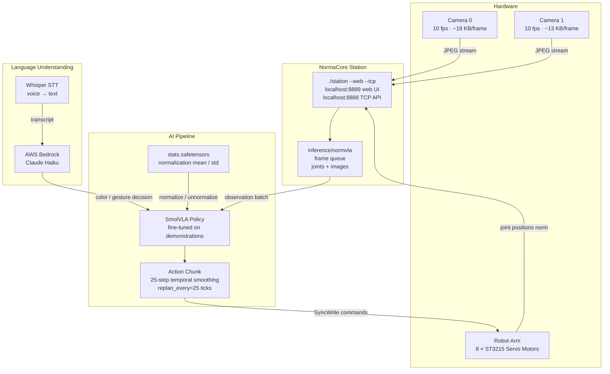
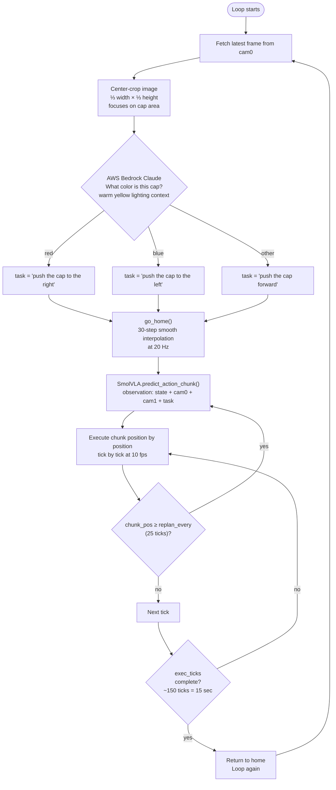
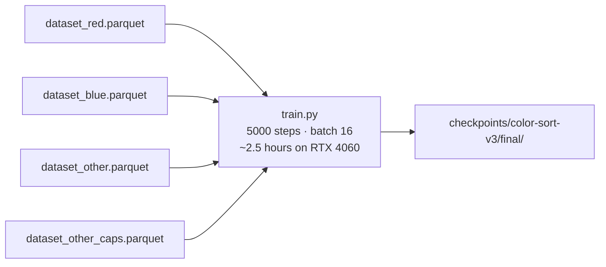
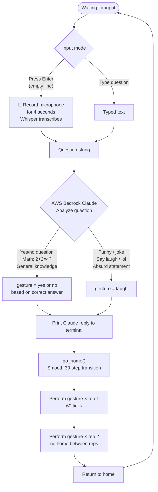
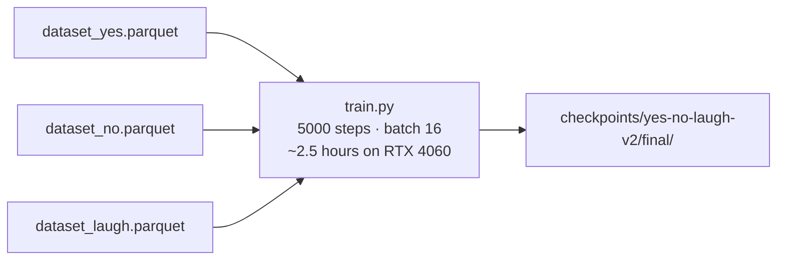

# Norma Robot — Color Sorting & Gesture Q&A

A physical robot arm that:
- **Sorts colored caps** (red → right, blue → left, other → forward) using camera + AWS Bedrock Claude for color detection and SmolVLA for motion
- **Answers questions with gestures** (yes / no / laugh) using voice input (Whisper) + Claude for reasoning + SmolVLA for motion

---

## Table of Contents

- [System Architecture](#system-architecture)
- [Hardware & Software Requirements](#hardware--software-requirements)
- [Environment Setup](#environment-setup)
- [Project Structure](#project-structure)
- [Color Sorting Robot](#color-sorting-robot)
- [Gesture Q&A Oracle](#gesture-qa-oracle)
- [Training Guide](#training-guide)
- [Troubleshooting](#troubleshooting)

---

## System Architecture



---

## Hardware & Software Requirements

### Hardware
| Component | Detail |
|---|---|
| Robot arm | NormaCore with 8 × ST3215 servos |
| Bus serial | `5B61034836` (right / orange arm) |
| Motor IDs | `1, 2, 3, 4, 5, 6, 7, 8` |
| Cameras | 2 × USB cameras at 10.1 fps |
| GPU | NVIDIA RTX 4060 8 GB (or equivalent CUDA GPU) |
| Microphone | Any USB or built-in mic for voice input |

### Software
| Package | Purpose |
|---|---|
| Python 3.10 | Runtime |
| PyTorch 2.x + CUDA | Model inference & training |
| SmolVLA | VLA policy (`software/ai/smolvla_py`) |
| boto3 | AWS Bedrock Claude API |
| openai-whisper | Speech-to-text |
| sounddevice | Microphone recording |
| Pillow | Image processing |
| uv | Fast Python package manager |

---

## Environment Setup

### 1. Start NormaCore Station

```bash
# In a dedicated terminal — keep running the whole time
./station --web --tcp
```

Serves:
- `http://localhost:8889` — web UI for manual arm control & recording
- `tcp://localhost:8888` — Python client API

### 2. AWS Credentials (for Bedrock Claude)

```bash
export AWS_ACCESS_KEY_ID=your_access_key
export AWS_SECRET_ACCESS_KEY=your_secret_key
export AWS_DEFAULT_REGION=us-east-1
```

Model used: `us.anthropic.claude-haiku-4-5-20251001-v1:0`
> Must use the `us.` cross-region inference profile prefix — plain model IDs fail with on-demand throughput.

### 3. Install Dependencies

```bash
cd software/ai/smolvla_py
uv sync
```

---

## Project Structure

```
software/station/examples/
├── color-sorting/
│   └── color_sort.py        # Color sorting robot (main script)
├── gesture/
│   ├── gesture_test.py      # Test gestures by typing yes/no/laugh
│   ├── oracle.py            # Q&A oracle — voice + text input → gesture
│   ├── oracle_simple.py     # Lightweight HTTP server for iPhone browser
│   └── oracle_web.py        # HTTPS server with MediaRecorder voice
└── read_tags.py             # Extract episode tags from station recording

software/ai/smolvla_py/
├── scripts/
│   └── train.py             # Fine-tune SmolVLA on demonstration data
├── smolvla/                 # Model architecture
└── checkpoints/             # Saved checkpoints (gitignored — too large)
    ├── color-sort-v3/final/
    └── yes-no-laugh-v2/final/
```

---

## Color Sorting Robot

### How It Works



**Color → task string mapping:**

| Detected color | Task string |
|---|---|
| Red | `push the cap to the right` |
| Blue | `push the cap to the left` |
| Other / none | `push the cap forward` |

**Home position (normalized, 8 joints):**
```python
HOME_POSITION_NORM = [0.531, 0.032, 0.464, 0.964, 0.496, 0.470, 0.494, 0.044]
```
> Derived from the mean of the first frame of each training episode.

---

### Recording a Dataset (Color Sort)

1. Open station web UI at `http://localhost:8889`
2. Manually drive arm to push a red cap to the right — tag the episode `red_start` / `red_stop`
3. Repeat for blue (`blue_start` / `blue_stop`) and other (`other_start` / `other_stop`)
4. Aim for **30+ episodes per color**

Generate parquet files:

```bash
cd software/station/examples

# Red cap
uv run python read_tags.py
# Follow the printed commands, e.g.:
uv run python ../../ai/smolvla_py/scripts/generate_dataset.py \
  --tag-start red_start --tag-stop red_stop \
  --task "push the cap to the right" \
  --episode-duration 45 \
  --output ../../../datasets/dataset_red

# Blue cap
uv run python ../../ai/smolvla_py/scripts/generate_dataset.py \
  --tag-start blue_start --tag-stop blue_stop \
  --task "push the cap to the left" \
  --episode-duration 45 \
  --output ../../../datasets/dataset_blue

# Other cap
uv run python ../../ai/smolvla_py/scripts/generate_dataset.py \
  --tag-start other_start --tag-stop other_stop \
  --task "push the cap forward" \
  --episode-duration 45 \
  --output ../../../datasets/dataset_other
```

---

### Training (Color Sort)



```bash
cd software/ai/smolvla_py

uv run python scripts/train.py \
  --parquets \
    ../../../datasets/dataset_red.parquet \
    ../../../datasets/dataset_blue.parquet \
    ../../../datasets/dataset_other.parquet \
    ../../../datasets/dataset_other_caps.parquet \
  --steps 5000 \
  --batch-size 16 \
  --lr 1e-4 \
  --warmup-steps 500 \
  --decay-steps 15000 \
  --decay-lr 2.5e-6 \
  --weight-decay 1e-4 \
  --grad-clip 10.0 \
  --output checkpoints/color-sort-v3
```

---

### Running (Color Sort)

```bash
cd software/ai/smolvla_py

uv run python ../../station/examples/color-sorting/color_sort.py \
  --checkpoint checkpoints/color-sort-v3/final \
  --bus-serial 5B61034836 \
  --task-style push \
  --motor-ids 1,2,3,4,5,6,7,8 \
  --exec-ticks 150 \
  --replan-every 25 \
  --max-delta-ticks 400
```

**Flags:**

| Flag | Default | Description |
|---|---|---|
| `--checkpoint` | required | Path to `final/` checkpoint folder |
| `--bus-serial` | required | `5B61034836` |
| `--task-style` | `push` | `push` for v2/v3, `pickup` for old checkpoints |
| `--exec-ticks` | 150 | Ticks per push (~15 sec at 10 fps) |
| `--replan-every` | 25 | Re-predict every N ticks |
| `--max-delta-ticks` | 400 | Safety cutoff — max joint Δ per tick |

**Terminal output:**
```
[Claude cam0] raw='red' → detected: RED
[predict] current=[0.53 0.03 ...] chunk[0]=[0.51 0.04 ...] chunk[-1]=[0.62 0.15 ...]
```

Press `Ctrl+C` → robot smoothly returns to home.

---

## Gesture Q&A Oracle

### How It Works



**Gesture → task string mapping:**

| Gesture | Task string |
|---|---|
| Yes | `nod yes` |
| No | `shake no` |
| Laugh | `laugh` |

**Home position for gestures:**
```python
GESTURE_HOME = [0.497, 0.036, 0.439, 0.970, 0.481, 0.613, 0.483, 0.494]
```

---

### Recording a Dataset (Gesture)

1. Open station web UI at `http://localhost:8889`
2. Record nodding yes motion — tag `yes_start` / `yes_stop`
3. Record shaking no motion — tag `no_start` / `no_stop`
4. Record laugh/wobble motion — tag `laugh_start` / `laugh_stop`
5. Aim for **30+ episodes per gesture** (min 20 for laugh)

Generate parquets:

```bash
cd software/station/examples

uv run python ../../ai/smolvla_py/scripts/generate_dataset.py \
  --tag-start yes_start --tag-stop yes_stop \
  --task "nod yes" \
  --episode-duration 10 \
  --output ../../../datasets/dataset_yes

uv run python ../../ai/smolvla_py/scripts/generate_dataset.py \
  --tag-start no_start --tag-stop no_stop \
  --task "shake no" \
  --episode-duration 10 \
  --output ../../../datasets/dataset_no

uv run python ../../ai/smolvla_py/scripts/generate_dataset.py \
  --tag-start laugh_start --tag-stop laugh_stop \
  --task "laugh" \
  --episode-duration 10 \
  --output ../../../datasets/dataset_laugh
```

---

### Training (Gesture)



```bash
cd software/ai/smolvla_py

uv run python scripts/train.py \
  --parquets \
    ../../../datasets/dataset_yes.parquet \
    ../../../datasets/dataset_no.parquet \
    ../../../datasets/dataset_laugh.parquet \
  --steps 5000 \
  --batch-size 16 \
  --lr 1e-4 \
  --warmup-steps 500 \
  --decay-steps 15000 \
  --decay-lr 2.5e-6 \
  --weight-decay 1e-4 \
  --grad-clip 10.0 \
  --output checkpoints/yes-no-laugh-v2
```

---

### Running (Gesture)

#### Option A — Terminal (voice + text, recommended)

```bash
cd software/ai/smolvla_py

uv run python ../../station/examples/gesture/oracle.py \
  --checkpoint checkpoints/yes-no-laugh-v2/final \
  --bus-serial 5B61034836
```

```
=== Robot Oracle ===
  • Press Enter (empty) → speak your question
  • Type a question    → press Enter to send
  • Type 'quit'        → exit

You (type or Enter to speak): Is the sky blue?
  Thinking ...
  Robot: Yes, the sky appears blue due to Rayleigh scattering.
  Gesture: YES × 2

You (type or Enter to speak):
  🎤 Recording for 4s ... speak now!
  You said: 'make me laugh'
  Gesture: LAUGH × 2
```

#### Option B — iPhone / any browser

```bash
# Terminal 1 — HTTP server on port 8080
uv run python ../../station/examples/gesture/oracle_simple.py \
  --checkpoint checkpoints/yes-no-laugh-v2/final \
  --bus-serial 5B61034836

# Terminal 2 — free public HTTPS tunnel (no account needed)
./cloudflared tunnel --url http://localhost:8080
```

Open the printed `https://xxxx.trycloudflare.com` URL on your phone.
Type or use the keyboard mic button to dictate → tap **Ask the Robot**.

#### Option C — Keyboard gesture tester (no Claude)

```bash
uv run python ../../station/examples/gesture/gesture_test.py \
  --checkpoint checkpoints/yes-no-laugh-v2/final \
  --bus-serial 5B61034836
```

Type `yes`, `no`, or `laugh` → robot performs the gesture immediately.

---

**All oracle.py flags:**

| Flag | Default | Description |
|---|---|---|
| `--checkpoint` | required | Path to `final/` checkpoint |
| `--bus-serial` | required | `5B61034836` |
| `--exec-ticks` | 60 | Ticks per gesture rep (~6 sec at 10 fps) |
| `--replan-every` | 25 | Re-predict every N ticks |
| `--max-delta-ticks` | 1000 | Safety limit per tick |
| `--whisper-model` | `base` | `tiny` fastest · `medium` most accurate |
| `--record-seconds` | 4.0 | Mic recording duration in seconds |
| `--claude-model` | `us.anthropic.claude-haiku-4-5-20251001-v1:0` | Bedrock model ID |

---

## Training Guide

### Episode count recommendations

| Class | Minimum | Recommended | Notes |
|---|---|---|---|
| Red | 20 | 30+ | Consistent cap placement |
| Blue | 20 | 30+ | Consistent cap placement |
| Other | 20 | 30+ | Use different colored caps |
| Yes | 20 | 30+ | Same speed every episode |
| No | 20 | 30+ | Same speed every episode |
| Laugh | 20 | 30+ | Most difficult — needs most data |

### Tips for clean data

1. **Always start from home** — move arm to exact home pose, hold still 3 sec before tagging start
2. **Consistent lighting** — record and run under same lights
3. **Smooth motions** — no pauses mid-gesture
4. **Place caps at same spot** — mark position on table with tape
5. **Short clean episodes** — 45 sec for sorting, 10 sec for gestures

### Training time on RTX 4060

| Batch size | Steps | Time | VRAM |
|---|---|---|---|
| 8 | 5000 | ~1.6 hr | ~3.7 GB |
| 16 | 5000 | ~2.5 hr | ~5.5 GB |
| 16 | 8000 | ~4.0 hr | ~5.5 GB |

### Loss targets

| Loss | Meaning |
|---|---|
| > 0.25 | Poor — need more data or steps |
| 0.17–0.25 | Acceptable |
| < 0.17 | Good |
| < 0.12 | Excellent |

---

## Troubleshooting

### Robot not moving at all (`sent=0 aborted=N`)
```bash
--max-delta-ticks 1000   # increase safety limit
```

### Robot misses the cap
- Place cap at exactly the same position as during recording
- Check `--task-style push` matches your checkpoint
- Increase `--exec-ticks 200` to give more time

### Claude detects wrong color
Check terminal: `[Claude cam0] raw='...' → detected: ...`
- Ensure warm yellow light doesn't shift colors
- Improve: add more center-cropped variation in dataset

### AWS ValidationException
Use `us.` prefix on model ID:
```
us.anthropic.claude-haiku-4-5-20251001-v1:0    ✅
anthropic.claude-haiku-4-5-20251001-v1:0        ❌
```

---

## Hardware Info Reference

| Property | Value |
|---|---|
| Camera FPS | 10.1 fps |
| cam0 avg JPEG size | 19 KB |
| cam1 avg JPEG size | 13 KB |
| Motor protocol | ST3215 SyncWrite |
| Target position register | `0x2A` |
| Action / State dimensions | 8 |
| Bus serial | `5B61034836` |
